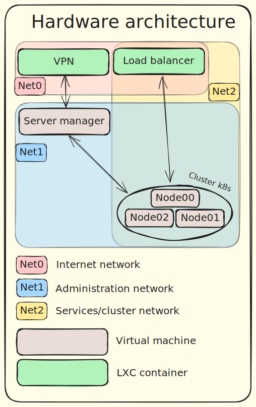

## Building a Home Lab to Learn Kubernetes

I wanted to learn Kubernetes—really learn it, not just follow a few tutorials.
While researching, I noticed many people build their own home labs to run cloud services or custom applications.
That inspired me to set up a complete home lab myself: first to run basic services like Nextcloud or OpenProject, and then to experiment with a full DevSecOps pipeline.

## First Step

To understand Kubernetes properly, I needed something close to real-world infrastructure.
Buying three or more physical servers wasn’t possible, so I decided to create everything on a single machine using multiple virtual machines (VMs).
This way I can spin up as many servers as I need and quickly learn how to build a cluster.

## Hypervisor

The hardware is modest: a tiny PC with 16 GB of RAM and a 500 GB drive.
Still, that’s enough to start.
I chose Proxmox as the hypervisor because it’s easy to set up and based on Debian, a Linux distribution I already know.

## Architecture

To make the lab feel like a real production setup, I set a few goals:
	•	Secure administration so I can manage the system safely from anywhere.
	•	Keep all development tools on the server so I can work from any computer.
	•	Simulate a realistic Kubernetes environment, including a load balancer in front of the cluster.

Here is the hardware architecture:

### Networks

The Proxmox server uses three separate virtual networks:
1.	Net0 – Connected to the physical network interface for internet access.
This is the first firewall layer for the cluster. Only customer-facing services are exposed here, and it also hosts the VPN endpoint.
2.	Net1 – The administration network, accessible only through the VPN.
It contains the Kubernetes cluster and a management VM running the Talos toolset.
It also hosts dashboards, logging, and storage management.
3.	Net2 – Dedicated to the load balancer and the cluster for application traffic.

### Load Balancer

In production, a cloud provider usually supplies the load balancer.
For learning purposes I wanted to build my own.
Because this service is lightweight, I run it in a container instead of a VM.

### VPN

The VPN container is critical for security.
To deploy or administer anything in the cluster, I must reach the Net1 network safely from outside.
Since the container’s only job is to provide VPN access, a full VM isn’t necessary.

### Server Manager

One VM acts as the Server Manager.
It hosts the Talos tool kit to manage the cluster nodes and will also run the GitOps system I use to administer the cluster.

## Proxmox Server Setup

Finally, the Proxmox host itself needs proper configuration:
	•	Create the three virtual networks.
	•	Add a DHCP server for each network.
	•	Assign static IP addresses to all machines.
	•	Set up routing and security rules so the networks communicate as needed.

Getting this base platform stable is the first milestone of the project.

